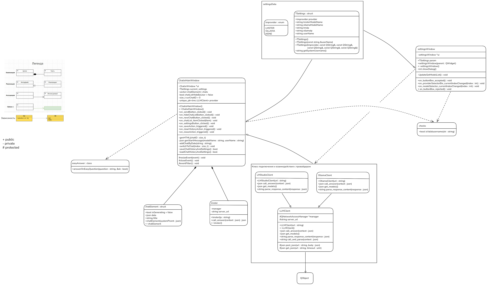

# Chatix
Простой чат-бот
Поддерживает LMStudio и Ollama

Функции:
- сохранение переписки и настроек
- автоматически подгружает имя пользователя из системы
- поддерживает параллельные чаты
- "лёгкие" команды

Что не реализовано, но хочется и колется:
- автозапуск провайдера
- передача файлов
- доступ БЯМ в интернет
- агентный режим
- побольше "лёгких" команд

UML:

